# Superstore Sales Case Study

This project presents an end-to-end Exploratory Data Analysis (EDA) of a retail dataset (Superstore), focusing on data cleaning, enrichment, and business insights generation. The aim is to build a clean, enriched dataset for strategic decision-making and visual storytelling.

---

##  Dataset

- **Source**: Superstore retail sales
- **Records**: 9994+
- **Columns**: 21 including Order details, Product, Customer, and Financials

---


##  Step-by-Step Approach

### 1. Data Overview

Initial inspection includes:

- Data shape, types, missing values
- Summary statistics and uniqueness analysis

**Plot:**  
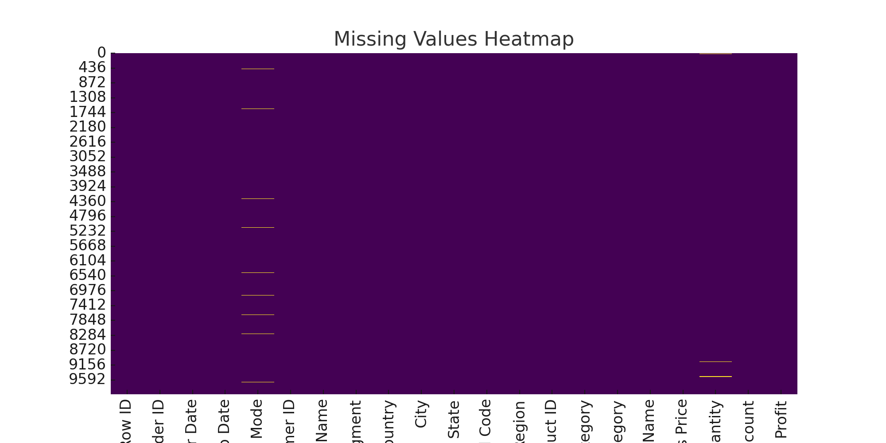

---

### 2. Duplicate Records Handling

- Identified duplicate Order IDs
- Removed 999+ duplicate rows
- Preserved data quality for analysis

**Plot:**  
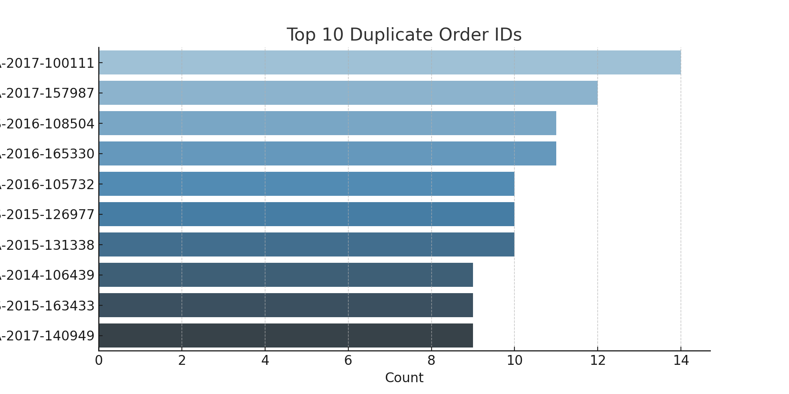

---

### 3. Date Fixing from Order ID

- Order ID contains embedded year (e.g. `CA-2014-XXXX`)
- Ensured `Order Date` year matched embedded year
- Fixed mismatches by replacing year in `Order Date`

**Plots:**

- 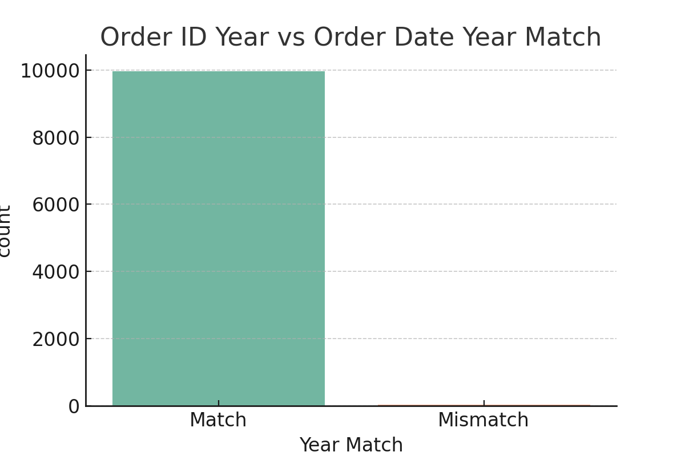
- 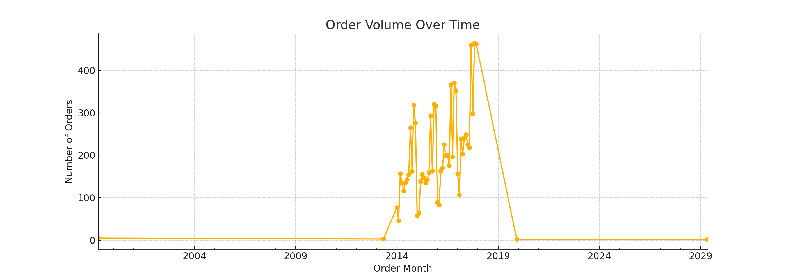

---

### 4. Shipping Time & Quantity Cleanup

- Computed `Days to Ship` from `Order Date` and `Ship Date`
- Imputed missing Ship Mode where possible
- Cleaned quantity column using median imputation

**Plots:**

- 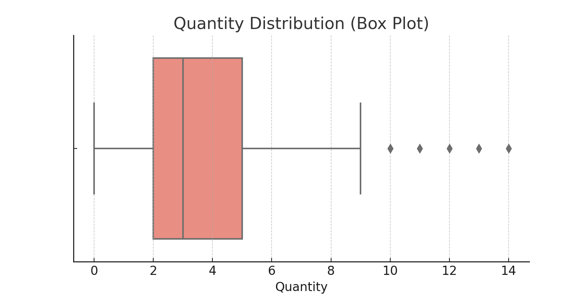
- 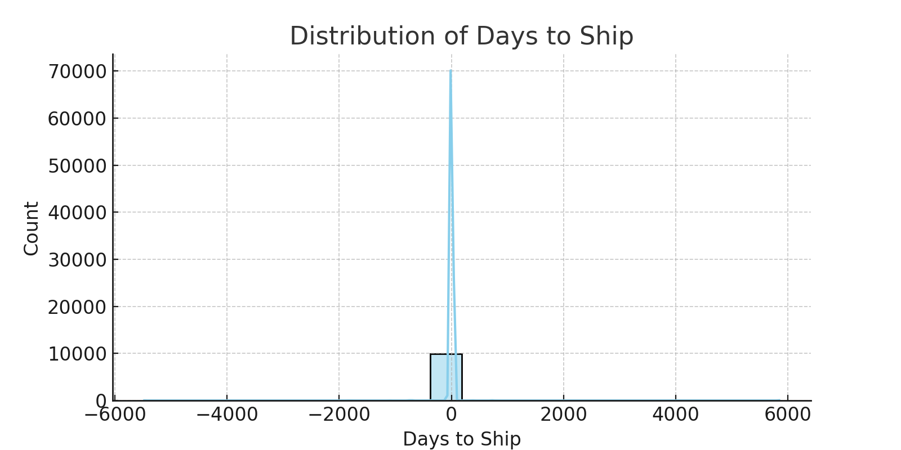

---

### 5. Customer Privacy Masking

- Converted full names to initials (e.g. "John Doe"  "J.D.")
- Dropped original names for privacy

**Plot:**

- 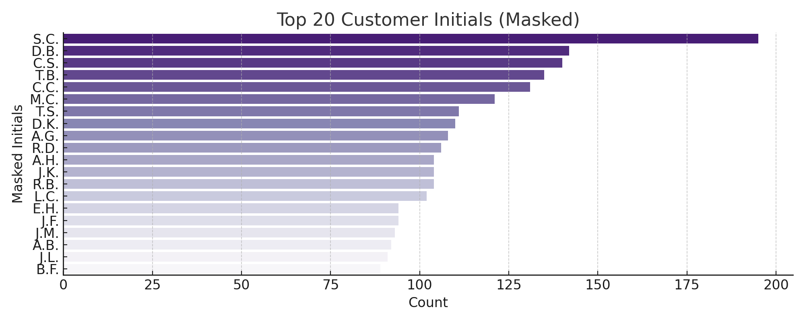

---

### 6. Postal Code & Type Conversion

- Standardized `Postal Code` to 5-digit format
- Converted `Sales Price` and `Profit` to numeric

---

### 7. State Mapping

- Replaced state abbreviations (e.g. "CA") with full names using US reference file

**Plot:**

- 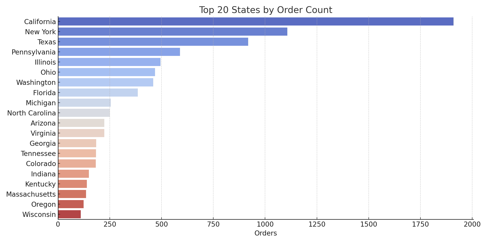

---

### 8. Feature Engineering

- Derived:
  - `Original Price` (before discount)
  - `Total Sales`, `Total Profit`, `Discount Price`, `Total Discount`
  - `Shipping Urgency` buckets: Immediate, Urgent, Standard

**Plot:**

- 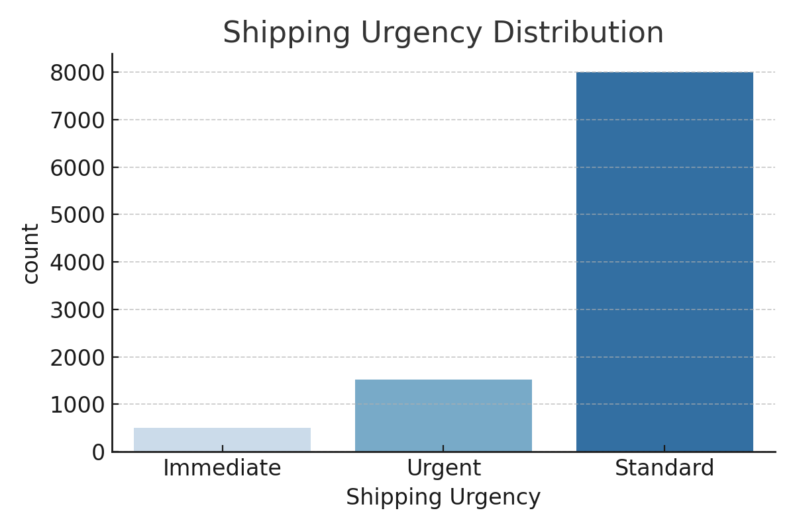

---

### 9. Outlier Removal (3IQR)

- Removed outliers from:
  - `Sales Price`
  - `Profit`

**Plots:**

- 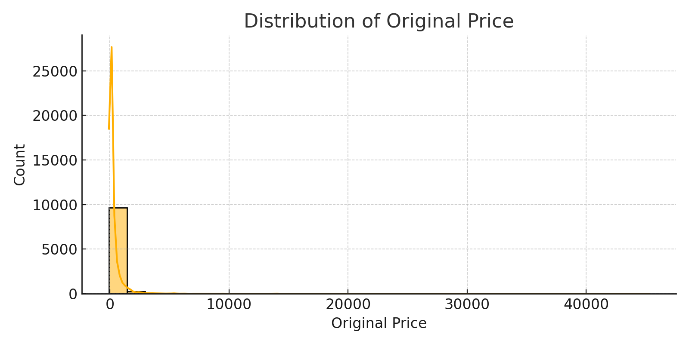
- 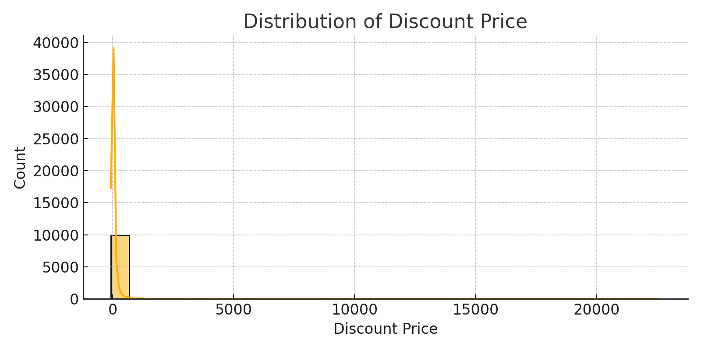
- 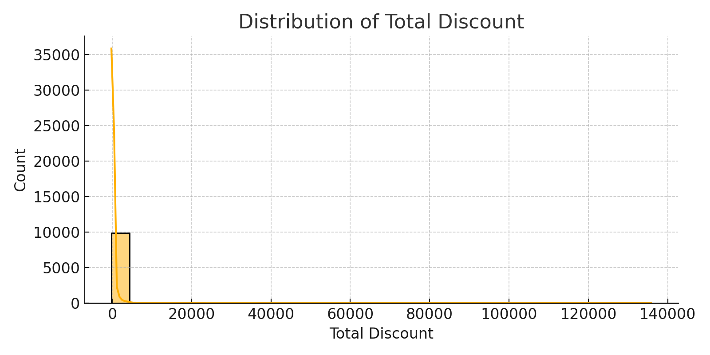

---

### 10. Customer Segmentation (RFM-inspired)

- Calculated quintiles for:
  - `Total Sales`
  - `Total Profit`

- Created segmentation heatmap

**Plots:**

- 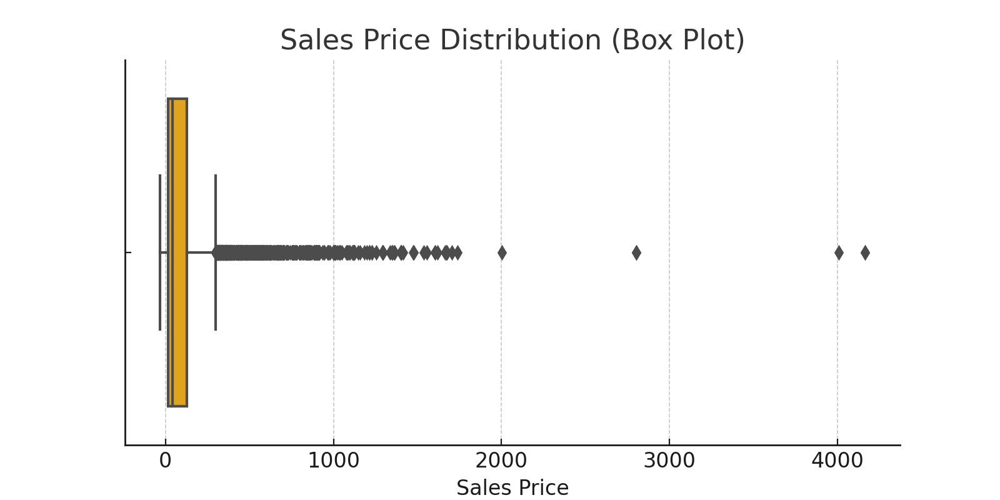
- 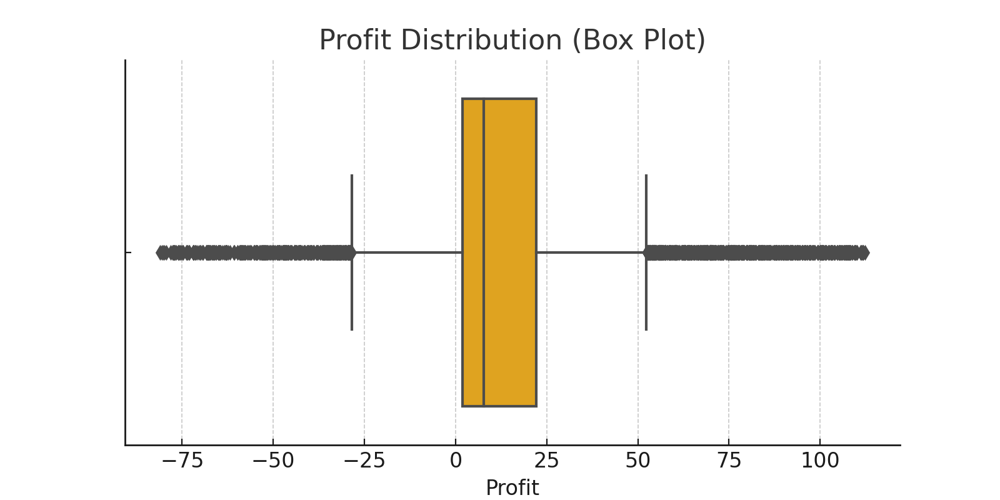
- 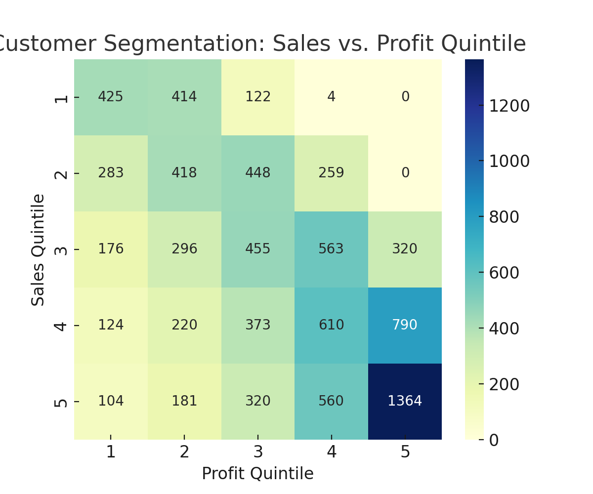

---

### 11. Profitability Analysis

- Identified:
  - Top 10 profitable products
  - Top 10 loss-making products

**Plots:**

- 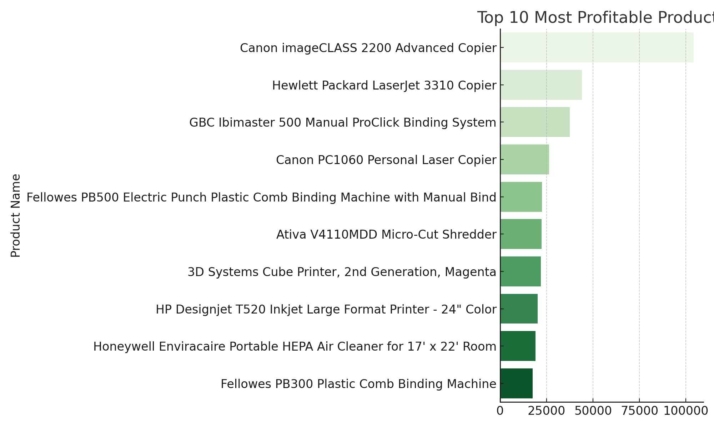
- 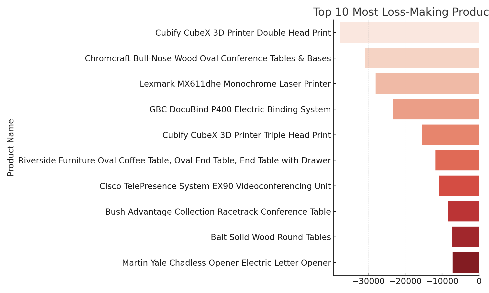
---

##  Output

- Cleaned dataset: `SuperStore_Cleaned_Final.csv`

---

## Why This Approach

### **1. Data Integrity and Consistency First**

- **Duplicate Detection & Removal**: Ensures that repeated transactions don't distort metrics like sales totals or customer behavior patterns.

- **Date Parsing and Correction**: `Order ID` year mismatches vs. `Order Date` are corrected to align business logic with reporting consistency (e.g., in time-series plots).

- **Type Casting (e.g., Quantity, Postal Code)**: Forces critical fields to predictable types so downstream aggregations and joins work correctly without exception handling.

**Insight**: This aligns with *data engineering* best practices — perform schema validation and transformation before running analytics.

---

### **2. Semantic Enrichment (Feature Engineering)**

> *Why?* Raw features alone don't reveal hidden insights.

- **Original Price & Discount Price**: Reconstructed to model actual discounting behavior — useful for pricing strategy analysis.

- **Shipping Urgency**: A derived categorical feature that compresses continuous "Days to Ship" into interpretable urgency levels — great for supply chain analysis.

- **Total Sales & Profit per Line Item**: Needed because original rows only give per-unit values — not realistic for profit margin tracking.

**Insight**: These engineered features are the backbone of *customer segmentation*, margin analysis, and operational KPIs.

---

### **3. Business-Oriented Visual Analytics**

> *Why?* The dashboard is for decision makers.

- **Monthly Order Trends**: Designed to help stakeholders understand seasonal performance.

- **Top Loss-Making Products**: Identifies cost drains or over-discounted SKUs.

- **Customer Segmentation with Quintiles**: Transforms raw numbers into percentile-based performance groups — enabling targeted marketing or loyalty campaigns.

**Insight**: The dashboard follows a *narrative design*, going from data quality → behavior → business KPIs.

---

### **4. Privacy by Design**

> *Why?* Even dummy datasets should model real-world constraints.

- **Customer Name Masking**: Applies best practices for data protection (e.g., GDPR) by pseudonymizing sensitive fields.

- Customer names are direct PII under laws like **GDPR**, **HIPAA**, and **CCPA**.

- Masking them helps simulate good **data anonymization** practices.

**Insight**: It reflects privacy-awareness, which is a must in production-level analytics pipelines.

---

### **5. Final Cleaned Dataset Download**

> *Why?* Enables downstream ML or BI integration.

- After the EDA and transformation pipeline, the export is **production-ready**, supporting:

  - Further modeling (insight generation, clustering, regression)

  - Reporting tools (Power BI, Tableau)

  - Sharing with other analytical teams
---

##  Folder Structure

```
Superstore_Case_Study/
 SuperStore_Dataset.csv
 SuperStore_Cleaned_Final.csv
 Superstore-Sales-Case-Study.ipynb
 app.py
 README.md
 plots/
     01_missing_values.png
     02_top_duplicates.png
     ...
```

---

##  Tech Stack

- Python 3.12
- Pandas 2.3.1
- Seaborn, Matplotlib
- Jupyter Notebook
